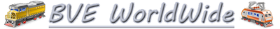
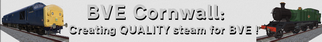

# Discussion Forums:

The BVE Worldwide forum hosts the official OpenBVE discussion board, and provides one of the larger European content hubs.

BVE Station hosts a large American & NYCTA community OpenBVE community, including both forums and downloads.

# Routes & Trains:

Home of the well-known Anthony Bowden's work. Contains highly realistic and detailed stuff for OpenBVE, formulas for animations and much more. 

Graymac's website with beautiful Irish and Welsh routes and also Irish rolling stock.

BrnoBVE Website. Home of the First Brno Track and Czech animated trains. The website also contains a few developing tools, free objects and a photo gallery of locos. 

MidnightExpress1981's site- Home of the D51 and the Tokohogu Shinkansen for OpenBVE.

An active Hungarian community, providing both routes and trains.

UK based routes and trains, in both diesel and steam.